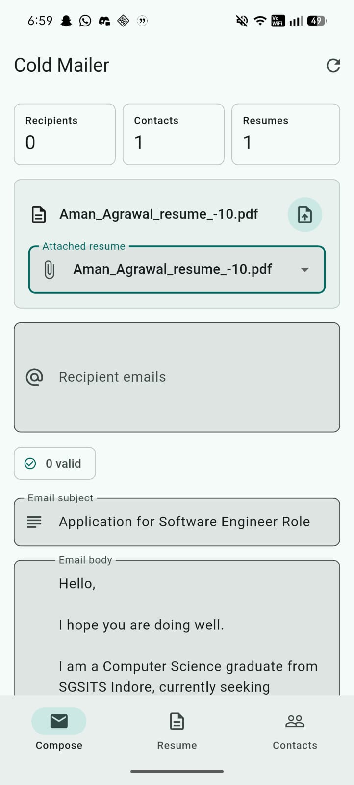
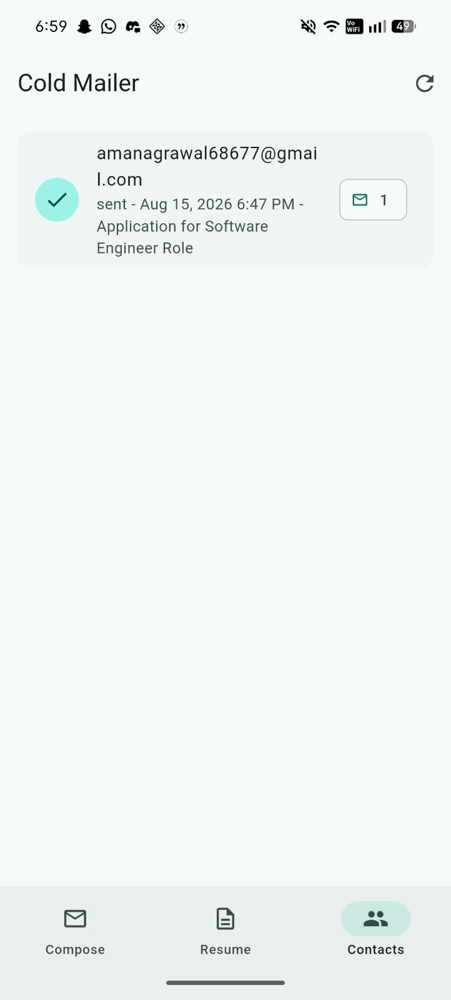
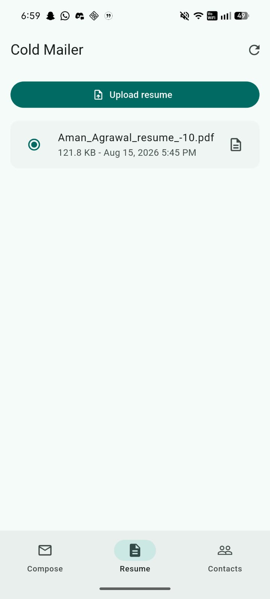

# Cold Mailer

A Flutter mobile app for sending cold emails with a selected resume attachment, backed by Supabase Storage, Postgres, and a Gmail-powered Supabase Edge Function.


## Screenshots

<p align="center">
  
  
  
</p>

## Features

- Upload PDF, DOC, or DOCX resumes to Supabase Storage.
- Compose a reusable email subject and body.
- Paste multiple recipient emails separated by commas, semicolons, spaces, or new lines.
- Automatically remove duplicate recipients and flag invalid emails.
- Send emails through Gmail without exposing Google credentials in the Flutter app.
- Store contacted emails, send status, subject, timestamps, and send counts in Supabase.
- View previously contacted recipients inside the app.
- Use `{{first_name}}` and `{{email}}` placeholders in the subject/body for lightweight personalization.

## Project Structure

```text
lib/
  main.dart
  models/
  screens/
  services/
supabase/
  migrations/
  functions/send-cold-email/
.env.example
```

## Environment Variables

All required variables are listed in `.env.example`.

The Flutter app reads only the client-safe values from the root `.env` file:

```env
SUPABASE_URL=https://your-project-ref.supabase.co
SUPABASE_ANON_KEY=your-supabase-anon-key
SUPABASE_RESUME_BUCKET=resume_uploads
SUPABASE_SEND_EMAIL_FUNCTION=send-cold-email
DEFAULT_EMAIL_SUBJECT=Application for Software Engineer Role
DEFAULT_EMAIL_BODY=Hi {{first_name}},\n\nI hope you are doing well...\n\nThank you for your time.
```

Keep Gmail credentials server-side. Put these in `supabase/.env` for local deploys or set them as Supabase secrets:

```env
GOOGLE_CLIENT_ID=your-google-oauth-client-id
GOOGLE_CLIENT_SECRET=your-google-oauth-client-secret
GOOGLE_REFRESH_TOKEN=your-google-oauth-refresh-token
GMAIL_FROM_EMAIL=your-email@gmail.com
GMAIL_FROM_NAME=Your Name
SUPABASE_URL=https://your-project-ref.supabase.co
SUPABASE_SERVICE_ROLE_KEY=your-supabase-service-role-key
SUPABASE_RESUME_BUCKET=resume_uploads
ALLOWED_ORIGIN=*
```

## Supabase Setup

1. Create a Supabase project.
2. Copy `.env.example` to `.env` and fill the Flutter client values.
3. Copy `supabase/.env.example` to `supabase/.env` and fill server secrets.
4. Link the local project:

```bash
supabase login
supabase link --project-ref your-project-ref
```

5. Apply the database migration:

```bash
supabase db push
```

The migration creates:

- `resumes`
- `contacts`
- `outbound_emails`
- `resume_uploads` private storage bucket
- storage/table policies needed by this single-user app
- `record_email_delivery(...)` RPC used by the Edge Function

The default policies allow anonymous app access for a personal tool. Before production, add Supabase Auth and restrict policies by user.

## Gmail Setup

1. Create or select a Google Cloud project.
2. Enable the Gmail API.
3. Create OAuth credentials.
4. Generate a refresh token with the Gmail send scope:

```text
https://www.googleapis.com/auth/gmail.send
```

5. Store `GOOGLE_CLIENT_ID`, `GOOGLE_CLIENT_SECRET`, `GOOGLE_REFRESH_TOKEN`, `GMAIL_FROM_EMAIL`, and `GMAIL_FROM_NAME` as Supabase Edge Function secrets.

Set secrets from the local env file:

```bash
supabase secrets set --env-file supabase/.env
```

Deploy the function:

```bash
supabase functions deploy send-cold-email
```

## Flutter Setup

Install dependencies:

```bash
flutter pub get
```

Run the app:

```bash
flutter run
```

Build Android:

```bash
flutter build apk
```

Build iOS from macOS:

```bash
flutter build ios
```

## Email Flow

1. The app uploads a selected resume to the `resume_uploads` storage bucket.
2. The app sends recipients, subject, body, and selected resume metadata to the `send-cold-email` Edge Function.
3. The Edge Function refreshes a Google access token.
4. The Edge Function downloads the resume from Supabase Storage and attaches it.
5. Gmail sends each email.
6. The Edge Function records every sent or failed attempt in Supabase.
7. The app refreshes the Contacts tab.

## Personalization

Use these placeholders in the email subject or body:

```text
{{first_name}}
{{email}}
```

For `jane.doe@example.com`, `{{first_name}}` becomes `Jane`.

## Testing

Run Flutter analysis and tests:

```bash
flutter analyze
flutter test
```

## Notes

- Do not put Google client secrets in the Flutter `.env`; anything bundled into a mobile app can be extracted.
- Gmail accounts have sending limits. Keep sending volumes compliant with Gmail, company, and local anti-spam rules.
- The included Supabase policies prioritize getting a personal app working end to end. Add authentication before using this with multiple users.
